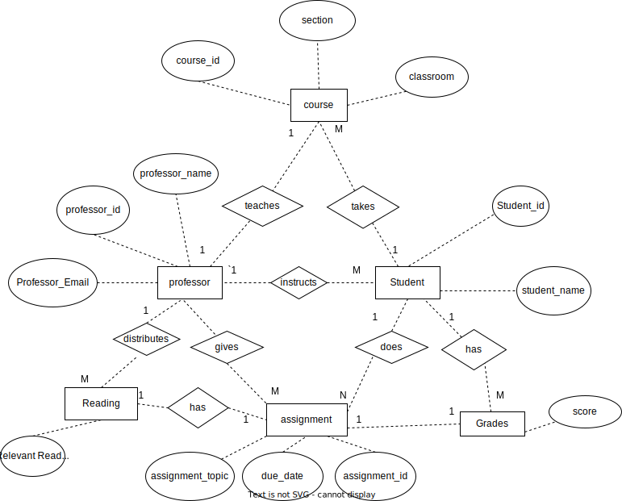

## 1. Row Data
| assignment_id | student_id | due_date | professor | assignment_topic                | classroom | grade | relevant_reading    | professor_email   |
| ------------- | ---------- | -------- | --------- | ------------------------------- | --------- | ----- | ------------------- | ----------------- |
| 1             | 1          | 23.02.21 | Melvin    | Data normalization              | WWH 101   | 80    | Deumlich Chapter 3  | l.melvin@foo.edu  |
| 2             | 7          | 18.11.21 | Logston   | Single table queries            | 60FA 314  | 25    | Dümmlers Chapter 11 | e.logston@foo.edu |
| 1             | 4          | 23.02.21 | Melvin    | Data normalization              | WWH 101   | 75    | Deumlich Chapter 3  | l.melvin@foo.edu  |
| 5             | 2          | 05.05.21 | Logston   | Python and pandas               | 60FA 314  | 92    | Dümmlers Chapter 14 | e.logston@foo.edu |
| 4             | 2          | 04.07.21 | Nevarez   | Spreadsheet aggregate functions | WWH 201   | 65    | Zehnder Page 87     | i.nevarez@foo.edu |

## 2. Main Reasons why not 4NF
1. The field email address is a fact about professors only, not a fact about other entities in this table. Also, the grade is not about professors. The table has multiple multivalued dependency.
2. This data redundancy makes maintaining the data difficult. Updating a grade for a student would have to be done across many records, not just in a singular place.
3. Update Anomalies: Data redundancy can lead to update anomalies. For example, updating the "relevant_reading" value for one assignment with the particular "assignment_id" and "professor" combination will require to update the same value for all assignments with the same condition.
4. If a student hasn't taken any assignment, they would not have a record at all.

## 3. Tables 4NF - compliant
### Professor
| professor_id| professor_name | professor_email   |
| --- | --------- | ----------------- |
|  1   | Melvin    | l.melvin@foo.edu  |
|  2  | Logston   | e.logston@foo.edu |
|3| Nevarez   | i.nevarez@foo.edu |

### Student
| student_id | student_name |
| ---------- | ------------ |
| 1          | bubu         |
| 7          | kaka         |
| 4          | gaga         |
| 2          | wawa         |
| 2          | yaya         |

### Readings
| assignment_id | professor_id | relevant_reading    |
| ------------- | ------------ | ------------------- |
| 1             | 1            | Deumlich Chapter 3  |
| 2             | 2            | Dümmlers Chapter 11 |
| 5             | 2            | Dümmlers Chapter 14 |
| 4             | 3            | Zehnder Page 87     |

### Grades
| assignment_id | student_id | grade |
|---------------|------------|-------|
| 1             | 1          | 80    |
| 2             | 7          | 25    |
| 1             | 4          | 75    |
| 5             | 2          | 92    |
| 4             | 2          | 65    |

### Assignments
| assignment_id | professor_id | assignment_topic                | due_date |
| ------------- | ------------ | ------------------------------- | -------- |
| 1             | 1            | Data normalization              | 23.02.21 |
| 2             | 2            | Single table queries            | 18.11.21 |
| 5             | 2            | Python and pandas               | 05.05.21 |
| 4             | 3            | Spreadsheet aggregate functions | 04.07.21 |

### Course
| course_id | section | professor_id | classroom |
| --------- | ------- | ------------ | --------- |
| 1         | 1       | 1            | WWH 101   |
| 1         | 2       | 2            | 60FA 314  |
| 1         | 3       | 3            | WWH 201   |

## 4. ER diagram

### 5. Changes
1. Identify the functional dependencies:
	1. Professor : email_address
	2. Student: student_id
	3. assignment:  assignment_id, due_date, professor, assignment_topic, grade
2. Identify the multivalued dependency, which we may need more than one value to determine another value. For example:
	1. (assignment_id, professor) -> relevant_reading
3. Create three separate tables: one for assignments and one for relevant readings, and one for professor.
	 Assignments Table:
			assignment_id (primary key),
			due_date,
			professor,
			assignment_topic,
			classroom,
			student_id,
			grades
		Relevant Readings Table:
			   assignment_id ,
			   professor_id,
			   Reading,
			   relevant_reading
4. Create a primary key for the assignments table: Assignments table should have a primary key that uniquely identifies each row. I use a combination of "assignment_id" and "professor_id" as the primary key. Topic and due_date are not independent, so it doesn't violate the 4NF. Classroom is partly dependent on professor, which should be split into another table. So is grades, which is dependent on student_id.
5. Create surrogate keys. For example, different professor may have the same classroom but for different sections. (In my case, I assume for the same course.); Different professors with the same name, using id as primary key. 
6. Create foreign keys. For example, in the readings table. IT should have a foreign key that references the assignments table. I use a combination of "assignment_id" and "professor_id" as the foreign key in the readings table.
7. To make it more realistic, I added the name of the students in the student table.
